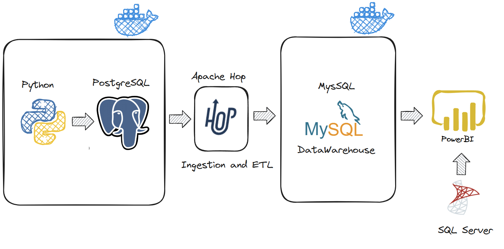

# Pipeline de Dados para Análise de Vendas de Produtos Hotmart

Este projeto foi desenvolvido para demonstrar a construção de um pipeline de ETL completo que integra dados de múltiplas fontes, processa-os, e os disponibiliza para análise por meio de um **Data Warehouse** centralizado. O pipeline inclui uma camada de staging e uma carga final no Data Warehouse, permitindo análises eficientes e centralizadas de dados de vendas online, com indicadores relevantes como receita total, vendas, ticket médio e muito mais.

Além disso, foi criado um painel simulado utilizando o **Power BI**, onde exploramos métricas estratégicas aplicáveis ao negócio da **Hotmart**, incluindo visualizações detalhadas para apoio na tomada de decisão.

---

## Fluxo do Projeto



O pipeline foi construído utilizando:

- **Python** para extração de dados.
- **PostgreSQL** como banco intermediário.
- **Apache Hop** para ingestão e processamento ETL.
- **MySQL** como Data Warehouse central.
- **Power BI** para visualização e análise de dados.

## Painel de Visualização

Além do pipeline, foi desenvolvido um painel no **Power BI** simulando indicadores relevantes, como receita total, vendas, ticket médio, entre outros.


---

## Requisitos

Antes de executar o projeto, certifique-se de que os seguintes pré-requisitos estejam atendidos:

1. **Docker e Docker Compose**:
   - Certifique-se de que o Docker e o Docker Compose estejam instalados e configurados corretamente em sua máquina.
   - Para instalar o Docker, siga as instruções disponíveis em [Docker Documentation](https://docs.docker.com/get-docker/).

2. **MySQL e PostgreSQL**:
   - O projeto utiliza as portas **3307** para o MySQL e **5435** para o PostgreSQL.

---

## Executando o Projeto

1. Clone este repositório ou baixe os arquivos necessários:

   ```sh
   git clone https://github.com/seu-usuario/repositorio.git
   cd repositorio
   ```

2. Execute o Docker Compose:

   ```sh
   docker compose up -d
   ```

3. Acesse o painel no Power BI.

4. Você pode acessar os datasets no MySQL e PostgreSQL:

   - MySQL: `localhost:3307`
   - PostgreSQL: `localhost:5435`

## Licensa

Este projeto utiliza a licenca MIT. Para obter mais informações, veja o arquivo [LICENSE](LICENSE.md).
